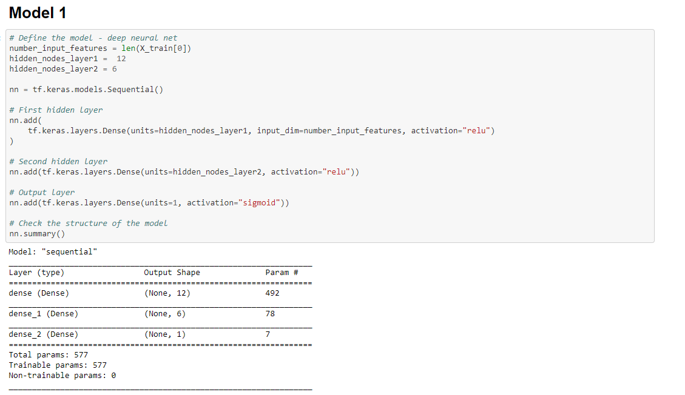
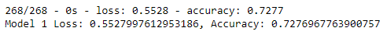

# Charity Sucess Analysis Using A Neural Network

For this project we built and trained a neural network to predict if a given charity will be successful if it is funded by our client's charity support firm. The dataset we used was a variety of information surrounding thousands of charities, including how successful they were at achieving their stated goals using they're available budget resources. We programmed a neural network to analyze the data and give a prediction. At that point we evaluated the performance of the model, and began to try and improve that performance by tweaking the model. Below is a record of our results and process.

## Results

Our target variable for the model from our dataset was the "Is Successful" category, indicting via yes or no whether that organization was successful with it's given funding. Our list of features used to program the model included:  
  
APPLICATION_TYPE ------- Alphabet Soup application type  
AFFILIATION ------------ Affiliated sector of industry  
CLASSIFICATION --------- Government organization classification  
USE_CASE --------------- Use case for funding  
ORGANIZATION ----------- Organization type  
STATUS ----------------- Active status  
INCOME_AMT ------------- Income classification  
SPECIAL_CONSIDERATIONS - Special consideration for application  
ASK_AMT ---------------- Funding amount requested  
  
There was also given information such as ID number which was dropped before entry to the model. For the first model we started with two layers of 12 and 6 neurons respectively, using the "relu" activation function. We wanted to start with a solid amount of processing in the network but not too much to create a baseline for our accuracy scores to work from. Here is the code to create the first model.
  

The reults for the first model were just shy of our target accuracy of 75% at roughly 72%, but with very high loss in the model.
  
  
  
From here, several tweaks were made to the model. Many more versions were created than the three submitted here, but we were unable to acheive the target accuracy score. Some of the steps used during the refining process were to double the amount of neurons in the two layers, as well as doubling the training epochs. Unfortunately this had marginal impact. Then I tried adding a third layer, further increasing the neurons, but this also had marginal impact. We tried running with 200 epochs. We also tried dropping different features from the data before analyzing trying to find if there were columns that were impacting the results negatively. I dropped special considerations and re-ran all models with no significant improvement. Additional activation functions were also tried, also giving no significant improvement. Submitted here are three of my better attempts. I began to suspect if there was insufficent data, or insufficent features to train a model to the desired accruacy. Further testing is required. It's also possible something was missed that is coruppting the training of the model that could not be identified in the testing we did.

### Summary

In closing, our best results were not much better than the first round, with the peak accuracy being at 74% but still with significant loss. It will require additional testing and refining of the model to determine what within the data is potentially causing the issues in training, or if perhaps an entirely different type of model is required to acheive the desired results. I did also create a Random Forest learning model and analyze the same data but still could not acheive the goal with the RF accuracy landing at 71%.
